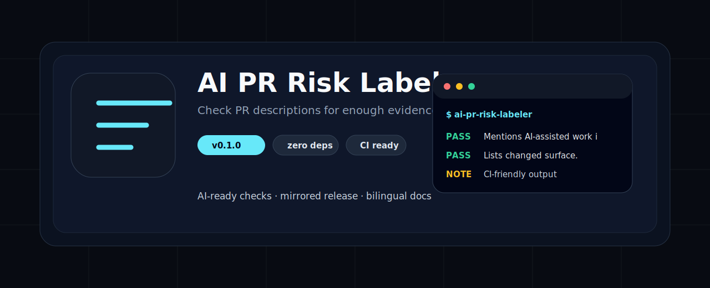
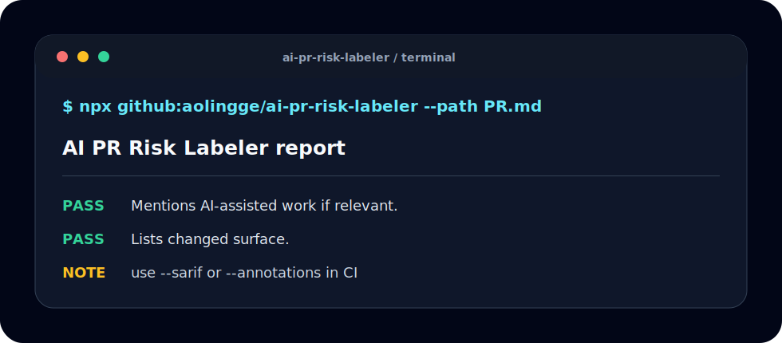

<p align="center">
  
</p>

<h1 align="center">AI PR 风险标签检查</h1>

<p align="center">检查 PR 描述是否足够支持给 AI 辅助改动打风险标签。</p>

<p align="center"><a href="README.md">English</a> · <a href="#快速开始">快速开始</a> · <a href="#检查项">检查项</a> · <a href="#ci-用法">CI</a></p>

<p align="center">
  
  
  
</p>

<p align="center">
  
</p>

## 为什么做这个

AI Agent 工具越来越多，但很多仓库缺少能在本地和 CI 里重复执行的小检查。这个工具保持零依赖、可镜像、可复制，适合学生、独立开发者和开源维护者使用。

## 快速开始

```bash
npx github:aolingge/ai-pr-risk-labeler --path PR.md
```

```bash
npx github:aolingge/ai-pr-risk-labeler --path PR.md --markdown > report.md
npx github:aolingge/ai-pr-risk-labeler --path PR.md --sarif > results.sarif
npx github:aolingge/ai-pr-risk-labeler --path PR.md --annotations
```

## 检查项

| 检查项 | 检查内容 |
| --- | --- |
| ai | 是否提及 AI 辅助工作（如相关）。 |
| surface | 是否列出变更范围。 |
| risk | 是否提及风险。 |
| verify | 是否提及验证方式。 |

## CI 用法

见 [docs/github-actions.md](docs/github-actions.md) 和 [docs/quality-gates.md](docs/quality-gates.md)。

## 镜像

- GitHub: https://github.com/aolingge/ai-pr-risk-labeler
- Gitee: https://gitee.com/aolingge/ai-pr-risk-labeler

## 参与贡献

适合首次贡献的任务：添加检查项、添加测试用例、改进文档，或添加 GitHub Actions 示例。

## 许可证

MIT
